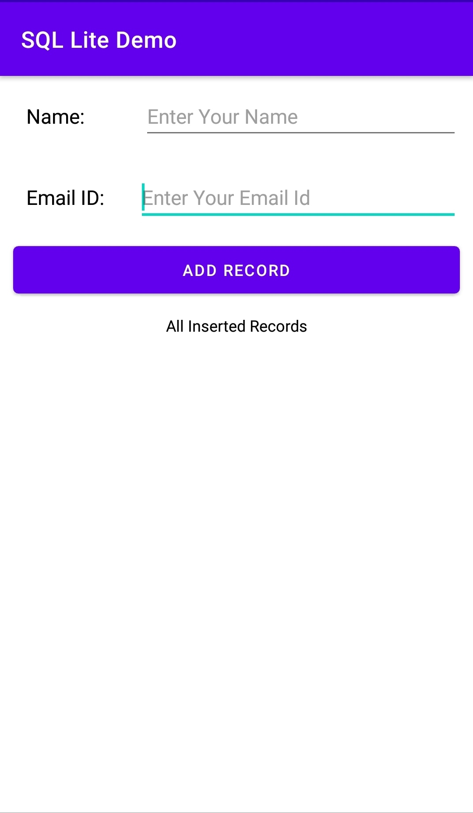
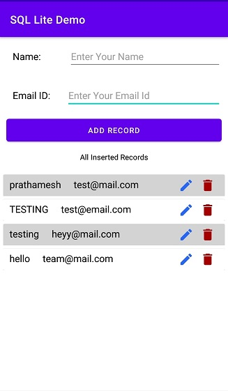
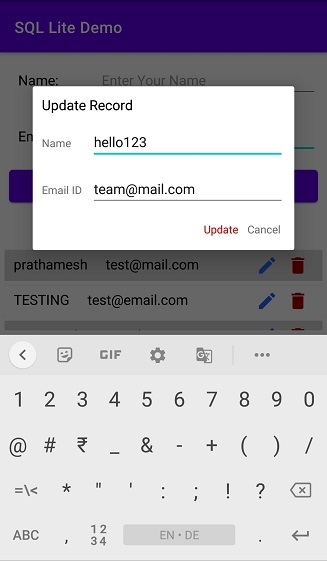
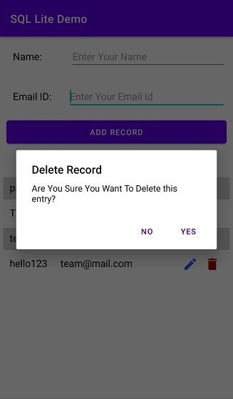

# SQLLiteDatabaseDemo
This is a sql lite demo app developed in Kotlin language. This app stores allows users to save Name and Email ID and also allows users to edit and delete the saved data.

App Working

# 1. MainActivity:

User can enter Name and Email Id and click on Save Button

# 2. Record Saved:

Records are saved in SQL Lite Database

# 3. Update Records Function

Click on the pencil icon to edit the saved data.

# 4. Delete Records

Click on Delete Icon and alert dialog will be displayed. Click on Yes to delete the record.

